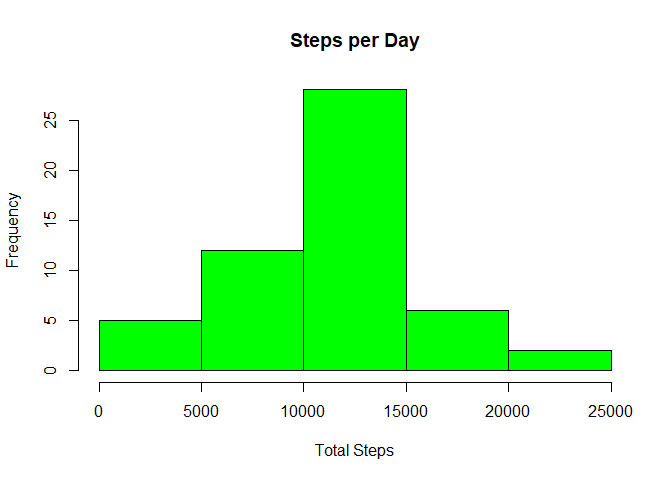
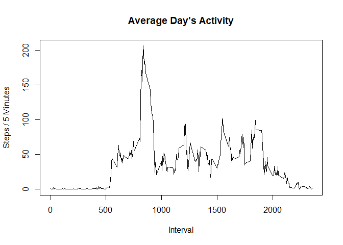
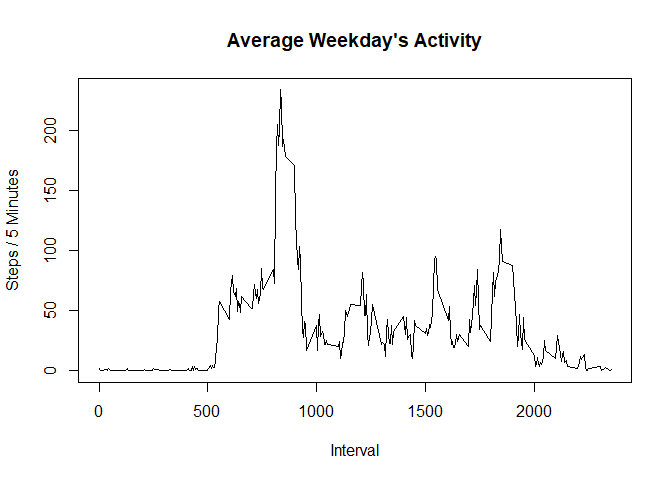
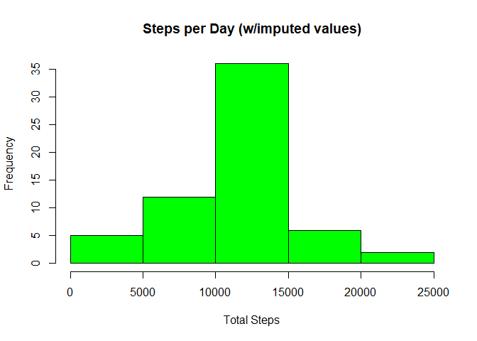
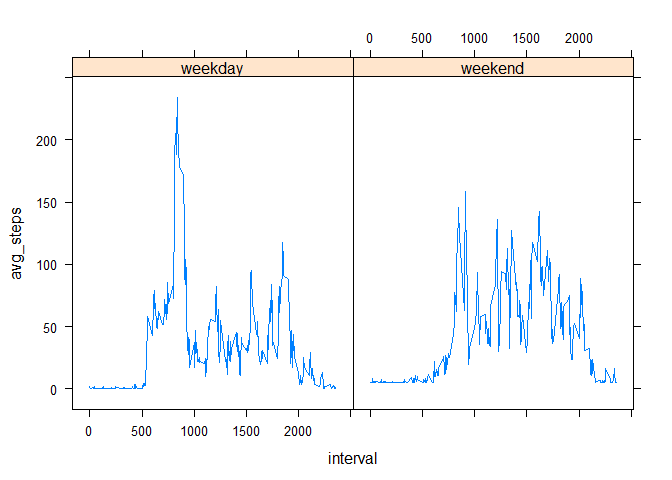

## Loading and preprocessing the data

The purpose of this analysis will be to explore some simple patterns in the physical activity of a single test subject over the course of a month. To this end, we will be using data from a personal activity monitoring device collected during the months of October and November 2015, which contains the number of steps taken by the subject in 5 minute intervals. The data is available online at https://github.com/rdpeng/RepData_PeerAssessment1. 

Note that the data is in the .csv file format. The data consists of 17,568 measurements conducted every 5 minutes, with each measurement recording the variables

* Steps: number of steps taken in 5 minute interval (missing values coded as '{r} NA')

* Date: date of the measurement, in "YYYY-MM-DD" format

* Interval: label of the 5 minute interval in which the measurement was taken (note: a label such as 635 corresponds to 06:35-06:40, so for instance there will be no label of the form 575) 

Presuming that this file is installed in the same directory as the file "activity.zip", the following code will extract the zipped data (if it hasn't been extracted already) and read it in. Note we will be making use of the "dplyr" package, so please install this via "install.packages()" if you do not have it already.


```r
library(dplyr)
```

```
## 
## Attaching package: 'dplyr'
```

```
## The following objects are masked from 'package:stats':
## 
##     filter, lag
```

```
## The following objects are masked from 'package:base':
## 
##     intersect, setdiff, setequal, union
```

```r
if(!("activity.csv" %in% dir())) {unzip("activity.zip")}
raw_data <- tbl_df(read.csv("activity.csv"))
```


## What is mean total number of steps taken per day?

We first use the following code to filter out any measurements which are missing a number of steps:


```r
data <- filter(raw_data, !is.na(steps))
```

The following dplyr pipeline will produce a vector containing the total number of steps taken in a day for all the observed days


```r
day_totals <- data %>% group_by(date) %>% summarize(total_steps = sum(steps)) 
```

From here it is easy to produce a historgram of the daily totals and compute the desired summary statistics:


```r
hist(day_totals$total_steps, xlab = "Total Steps", main = "Steps per Day", col = "green")
```

<!-- -->

Where the mean and median number of steps per day are given, respectively, by


```r
mean(day_totals$total_steps)
```

```
## [1] 10766.19
```

```r
median(day_totals$total_steps)
```

```
## [1] 10765
```

## What is the average daily activity pattern?

The following code will take our data (still momentarily disregarding NA values) and produce an average day's worth of 5 minute measurements.


```r
avg_day <- data %>% group_by(interval) %>% summarize(avg_steps = mean(steps))
```

By plotting a time series of this, we can start to understand how the general profile of a day looks


```r
plot(x = avg_day$interval, y = avg_day$avg_steps, type = "l", ylab = "Steps / 5 Minutes", xlab = "Interval", main = "Average Day's Activity")
```

<!-- -->

Additionally, we may determine the most active 5-minute interval on average by running


```r
avg_day$interval[which.max(avg_day$avg_steps)]
```

```
## [1] 835
```

## Imputing missing values

Let us first see how much of the dataset is missing:


```r
nrow(filter(raw_data, is.na(steps)))
```

```
## [1] 2304
```

So 2304 observations are missing - as this represents just about 13 percent of all values, a significant segment of the data set, it may be worth imputing these missing values from existing data. We propose the following scheme for imputing these values: as weekdays are likely to be subject to a strict regimen, we will fill in any missing values for an interval in a weekday with the average number of steps taken in that interval over all weekdays. 

In contrast, we do not expect a highly consistent pattern of activity during the weekends. Thus any missing data during a weekend will more broadly be filled in with the average number of steps taken in any five minute interval over any weekend. To implement this imputing strategy, we will need therefore two things: an average provile of a weekday, along with an average number of steps per 5 minutes for a weekend. We can obtain the first by modifying only slightly the code used above to calculate our daily activity pattern


```r
weekend = c("Saturday", "Sunday")
avg_wkday <- data %>% mutate(date = as.Date(date)) %>% filter(!(weekdays(date)  %in% weekend)) %>% group_by(interval) %>% summarize(avg_steps = mean(steps))
```

Just out of curiosity, we can plot this to see if it differs in any significant way from the daily trend we observed before (including weekends):


```r
plot(x = avg_wkday$interval, y = avg_wkday$avg_steps, type = "l", ylab = "Steps / 5 Minutes", xlab = "Interval", main = "Average Weekday's Activity")
```

<!-- -->


Here we calculate the average weekend behavior


```r
avg_wkend <- data %>% mutate(date = as.Date(date)) %>% filter(weekdays(date) %in% weekend) %>% summarize(avg_int = mean(steps))

wkend_rep <- avg_wkend$avg_int[1]
```

Using these, we can fill in missing values:


```r
int_avg <- function(interval){
  index = which(avg_wkday$interval == interval)
  avg_wkday$avg_steps[index]
}
```

The key step in the following pipeline is the replacement of the "steps" variable.


```r
temp_data <- raw_data %>% mutate(date = as.Date(date)) %>% mutate(is_wkend = weekdays(date) %in% weekend)
rep_values <- ifelse(temp_data$is_wkend, wkend_rep, sapply(temp_data$interval, int_avg))
imp_data <- mutate(temp_data, steps = ifelse(is.na(steps),rep_values,steps))
```

Now the "imp_data" variable is identical to the original data set with all of the missing values imputed as per our scheme. Using the same code as before, we can produce a histogram of the total steps taken in any day


```r
imp_day_totals <- imp_data %>% group_by(date) %>% summarize(imp_total_steps = sum(steps)) 
hist(imp_day_totals$imp_total_steps, xlab = "Total Steps", main = "Steps per Day (w/imputed values)", col = "green")
```

<!-- -->


```r
mean(imp_day_totals$imp_total_steps)
```

```
## [1] 10762.05
```

```r
median(imp_day_totals$imp_total_steps)
```

```
## [1] 10571
```

We note that this imputing scheme does not change the amount of days with rare amounts of activity, but rather brings more days nearer to the median activity. This does not come as too much of a suprise, considering we are using averaging techniques to produce our imputed values. In line with this, we observe that our mean for daily totals barely changes, while our median does change slightly. Computing the standard deviation of the two lists of day totals, however, we see:


```r
sd(imp_day_totals$imp_total_steps)
```

```
## [1] 3990.004
```

```r
sd(day_totals$total_steps)
```

```
## [1] 4269.18
```

So this change in the median is still quite small, relative to either distribution. 

## Are there differences in activity patterns between weekdays and weekends?

Note that we have already identified dates which correspond to weekdays vs. weekends in our imputing step. To make this variable more readable, we will rename the boolean values in "is_wkend".


```r
imp_data <- imp_data %>% mutate(is_wkend = ifelse(is_wkend, "weekend", "weekday"))
```

Next, we calculate an average weekend/weekday activity profile and display them side by side.


```r
two_days <- imp_data %>% group_by(is_wkend) %>% group_by(interval, add = TRUE) %>% summarise(avg_steps = mean(steps))
t <- ungroup(two_days)
library(lattice)
xyplot(avg_steps~interval | is_wkend, type = "l", data = t)
```

<!-- -->
